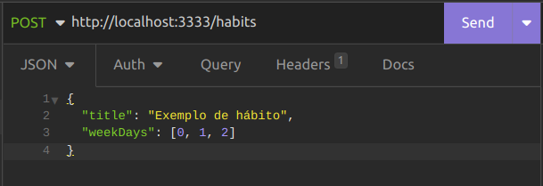
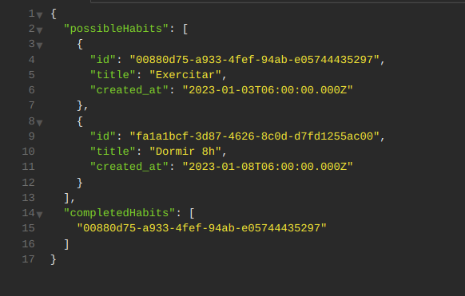
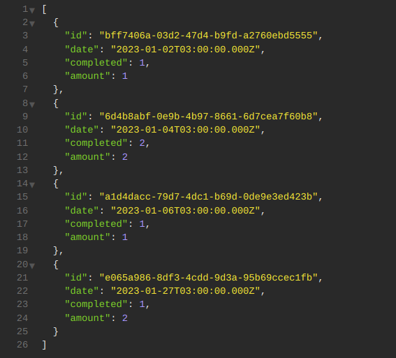

  <a href="#-tecnologias">Tecnologias</a>&nbsp;&nbsp;&nbsp;|&nbsp;&nbsp;&nbsp;
  <a href="#-projeto">Projeto</a>&nbsp;&nbsp;&nbsp;|&nbsp;&nbsp;&nbsp;
  <a href="#-como-rodar">Como rodar</a>&nbsp;&nbsp;&nbsp;|&nbsp;&nbsp;&nbsp;
  <a href="#-como-contribuir">Como contribuir</a>&nbsp;&nbsp;&nbsp;
  

 

## NLW Setup - Habits

## 🚀 Tecnologias

Esse projeto foi desenvolvido com as seguintes tecnologias:

- [Nodejs](https://nodejs.org/en/) - v18.12.1
- [Npm](https://www.npmjs.com/) - 8.19.2
- [SQLite](https://www.sqlite.org/index.html)
- [Prisma](https://www.prisma.io/docs)
- [TypeScript](https://www.typescriptlang.org/)

## 💻 Projeto

Projeto desenvolvido com API em Node.js para a criação e manutenção de hábitos do dia.

Evento do NLW na plataforma da [Rocketseat](https://www.rocketseat.com.br/).

- [Frontend Reactjs - Web](https://github.com/leticea/habits-app-nlw-react)
- [Frontend React Native - Mobile](https://github.com/leticea/habits-app-nlw-react-native)

## 🚀 Como Rodar

- Clone o projeto.
- Entre na pasta do projeto e rode 'npm install' (use 'yarn install' se for essa a sua configuração).
- npx prisma migrate dev (para configurar o banco de dados).
- npx prisma studio (para rodar a página do banco de dados).
- npm run dev (roda o servidor na porta localhost:3333).

## 👩🏿‍💻 Rotas

- **`POST /habits`**: Rota para criação de hábitos:

Envia:

  

- **`GET /day?date=2023-01-29T03:00:00.000z`**: Rota para mostrar os hábitos do dia:

Retorna:

  

- **`GET /summary`**: Rota para mostrar o resumo dos hábitos criados:

Retorna:

  

- **`PATCH /habit/:id/toggle`**: Rota para marcar ou desmarcar um hábito como feito.

## 🤔 Como contribuir

- Faça um fork desse repositório;
- Cria uma branch com a sua feature: `git checkout -b minha-feature`;
- Faça commit das suas alterações: `git commit -m 'feat: Minha nova feature'`;
- Faça push para a sua branch: `git push origin minha-feature`.

Depois que o merge da sua pull request for feito, você pode deletar a sua branch.

## 📝 Licença

Esse projeto está sob a licença MIT.